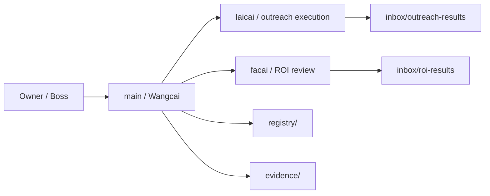

# Creator Outreach OPC Architecture v2

## Core shape

This package uses a two-layer topology:

- one controller brain: Wangcai (`main`)
- two narrow execution agents: `laicai`, `facai`
- one non-agent system layer: `registry`, `evidence`, `inbox`

## Topology

## Design decisions

1. There is no middle manager agent. Wangcai is the only controller.
2. Facebook page-by-page verification belongs to Wangcai because it is stateful, fragile, and evidence-heavy.
3. Laicai and Facai never write formal records directly; they submit packets into the inbox layer.
4. Registry writes, dedup decisions, and approvals all belong to Wangcai.
5. Every phase ends with a deliverable artifact that the next phase can consume.
