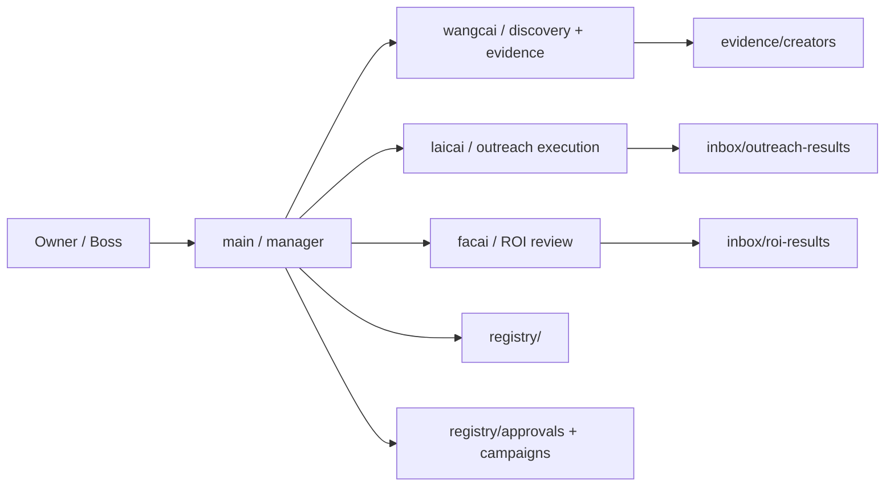

# Creator Outreach OPC Architecture v3

## Core shape

This package uses a two-layer topology:

- one controller brain: `main`
- three narrow execution agents: `wangcai`, `laicai`, `facai`
- one non-agent system layer: `registry`, `evidence`, `inbox`

## Why this shape

The client files clearly require four roles, but they mix real workflow needs with a few unsafe assumptions.

What we keep:

- one manager-facing controller
- one scouting role
- one outreach role
- one ROI role
- no direct employee-to-employee communication

What we correct:

- v1 should stay email-first, not multi-channel by default
- silent boss pass can only apply to low-risk candidate release, not replies or terms
- discovery and hard evidence should belong to a dedicated executor, not get mixed into manager chatter

## What is borrowed from gstack

This design borrows structure from gstack, not its software-delivery role names:

1. one orchestrator
2. explicit stage ownership
3. output artifacts between stages
4. specialist capability concentrated in the right executor
5. controller reviews and routes instead of doing every step

## Topology

## Stage owners

1. intake and rule lock -> `main`
2. discovery and evidence -> `wangcai`
3. dedup and formal registration -> `main`
4. outreach execution -> `laicai`
5. reply approval -> `main`
6. day4/day8 ROI review -> `facai`
7. optimization updates -> `main`
