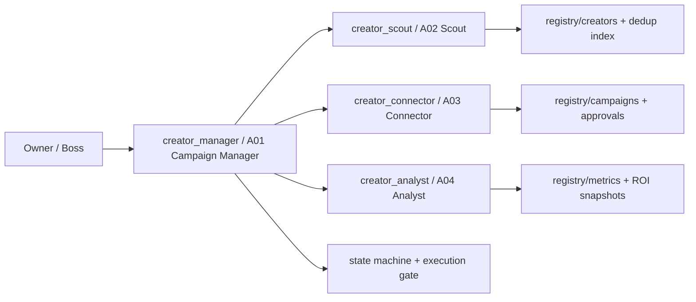

# Creator Outreach OPC Architecture v1

## Purpose

This architecture is designed for a creator-outreach operation using OpenClaw
as a control plane with:

- one manager
- three specialist agents
- one shared constitution
- one structured registry and campaign state layer
- explicit approval gates
- email-first outbound delivery
- no dependence on a heavyweight external orchestrator

## Topology

## Architectural layers

### 1. OpenClaw overlay layer

- agent registration
- workspace injection
- tool policy
- subagent allowlist
- additive config merge

### 2. coordination layer

- one manager owns routing, approval, escalation, and final reporting
- specialists operate within strict role boundaries

### 3. structured state layer

- creator registry
- campaign state records
- approval records
- metrics snapshots

### 4. integration layer

- host-provided model config
- optional email provider credentials
- optional search enrichment

## Design decisions

1. OpenClaw is the orchestration plane, not the sole business database.
2. Approval and deduplication are first-class state transitions, not prompt folklore.
3. Specialists do not talk to each other directly; manager-mediated control is the default.
4. V1 is email-first to keep operational complexity low while preserving future channel expansion.
5. Optional skills and integrations should degrade gracefully instead of breaking install.
